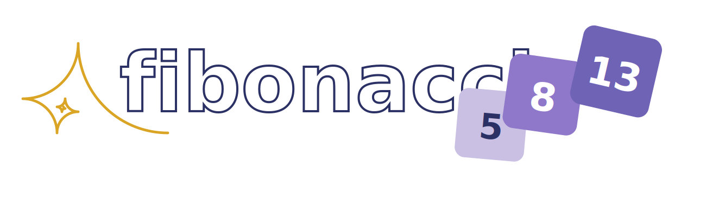

# 

[2048](https://www.2048.org/) is a video game that was super hype a few years back. The rules were simple, you had to two equal numbers to create its double. So 1 and 1 became 2, 2 and 2 became 4, and so on.

Fibonacci was a famous mathematician responsible for the [Fibonacci sequence](https://en.wikipedia.org/wiki/Fibonacci_sequence) you may have heard stressed with in University. It goes like this:

$F_(n+1) = F(n) + F(n+1)$

So the first numbers of the sequence are 1, 1, 2, 3, 5, 8, 13 and so on.

These two concepts combined provide the perfect opportunity to play around with front-end development. 
The game development allowed me to work on the logic to enforce the game rules, revisit unit testing, experiment with CSS and get creative!

You may play it [online](www.fibonacci.gg) on your desktop, tablet or mobile device.

If you find any problems, please feel free to [open a bug](https://github.com/ritamcastro/fibonaci.gg/issues/new).

Have fun!
___
©️ ritamcastro 2026 💜
